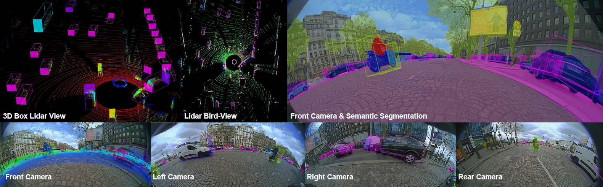

# WoodScape: A multi-task, multi-camera fisheye dataset for autonomous driving
The repository containing tools and information about the WoodScape dataset.

**Update (March 5th, 2021):**
WoodScape paper was published at ICCV in November 2019 and we announced that the dataset was planned to be released in Q1 2020. Unfortunately, there were unexpected data protection policies required in order to comply with requirements for EU GDPR and Chinese data laws. Specifically, we had to remove one third of our dataset which was recorded in China and also employ a third party anonymization company for the remaining data. It was exacerbated by COVID situation and the subsequent economic downturn impacting the automotive sector. We apologize for the delay in the release by more than a year.

Finally, we have released the first set of tasks in our Google Drive ([link](https://drive.google.com/drive/folders/1X5JOMEfVlaXfdNy24P8VA-jMs0yzf_HR?usp=sharing)). It has 8.2K images along with their corresponding 8.2K previous images needed for geometric tasks. The remaining 1.8K test samples are held out for a benchmark. It currently has annotations for semantic segmentation, instance segmentation, motion segmentation and 2D bounding boxes. Soiling Detection and end-to-end driving prediction tasks will be released by March 15th, 2021. Sample scripts to use the data will be updated in the github shortly as well. Once this first set of tasks is complete and tested, additional tasks will be gradually added. The upcoming website will include an overview about the status of the additional tasks.

Despite the delay we still believe the dataset is unique in the field. Therefore we understand that this dataset has been long awaited by many researchers. We hope that an eco-system of research in multitask fisheye camera development will thrive based on this dataset. We will continue to bugfix, support and develop the dataset and therefore any feedback will be taken onboard.


## Demo
Please click on the image below for a teaser video showing annotated examples and sample results.

[](https://streamable.com/aiefb "")

## Dataset Contents

This dataset version consists of 10K images with annotations for 6 tasks. 
 * RGB images
 * Semantic segmentation
 * 2D bounding boxes
 * Instance segmentation
 * Motion segmentation 
 * Previous images
 * CAN information
 * Lens soiling data and annotations

Coming Soon: 
 * Calibration Information
 * Fisheye sythetic data with semantic annotations
 * Lidar and dGPS scenes

## Data organization

```
woodscape
│   README.md    
│
└───rgb_images
│   │   00001_[CAM].png
│   │   00002_[CAM].png
|   |   ...
│   │
└───previous_images
│   │   00001_[CAM]_prev.png
│   │   00002_[CAM]_prev.png
|   |   ...
│   │
└───semantic_annotations
        │   rgbLabels
        │   │   00001_[CAM].png
        │   │   00002_[CAM].png
        |   |   ...
        │   gtLabels
        │   │   00001_[CAM].png
        │   │   00002_[CAM].png
        |   |   ...
│   │
└───box_2d_annotations
│   │   00001_[CAM].png
│   │   00002_[CAM].png
|   |   ...
│   │
└───instance_annotations
│   │   00001_[CAM].json
│   │   00002_[CAM].json
|   |   ...
│   │
└───motion_annotations
        │   rgbLabels
        │   │   00001_[CAM].png
        │   │   00002_[CAM].png
        |   |   ...
        │   gtLabels
        │   │   00001_[CAM].png
        │   │   00002_[CAM].png
        |   |   ...
│   │
└───vehicle_data
│   │   00001_[CAM].json
│   │   00002_[CAM].json
|   |   ...
│   │
└───soiling_dataset
        │   rgb_images
        │   │   00001_[CAM].png
        │   │   00002_[CAM].png
        |   |   ...
        │   gt_labels
        │   │   00001_[CAM].png
        │   │   00002_[CAM].png
        |   |   ...
        │   gt_labels
        │   │   00001_[CAM].png
        │   │   00002_[CAM].png
        |   |   ...
```
[CAM] :

FV --> Front CAM

RV --> Rear CAM

MVL --> Mirror Left CAM

MVR --> Mirror Right CAM


## Annotation Information

* Instance annotations are provided for more than 40 classes as polygons in json format. 
  A full list of classes can be found in "/scripts/mappers/class_names.json"
  
* We provide semantic segmentation annotations for 10 classes: void, road, lanes, curbs, rider, person, vehicles, bicycle, motorcycle and traffic_sign. 
  You can generate the segmentation annotations for all the 40+ classes using the provided scripts.
  See the examples,
  For 3(+void) classes: "scripts/configs/semantic_mapping_3_classes.json"
  For 9(+void) classes: "scripts/configs/semantic_mapping_9_classes.json"  
  
* We provide 2D boxes for 5 classes: pedestrians, vehicles, bicycle, traffic lights and traffic sign. 
  You can generate the 2D boxes for 14+ classes using the provided scripts.
  See the example,
  For 5 classes: "scripts/configs/box_2d_mapping_5_classes.json"
  
* Motion annotations are available for 19 classes. 
  A full list of classes, indexes and colour coding can be found in motion_class_mapping.json


## Installation

Use the package manager [pip](https://pip.pypa.io/en/stable/) to install the required packages.

```bash
pip install numpy
pip install opencv-python
pip install tqdm
pip install shapely
pip install Pillow
pip install matplotlib
```
In windows shapely might raise polygon OSError: [WinError 126], use conda distribution as an alternative or install directly from .whl

## Usage

To generate segmenatic or 2D boxes for more additional classes. Please use the following scripts

<span style="color:blue">semantic_map_generator.py</span>.:
Generate the semantic segmentation annotations from json instance annotations 

```bash
python semantic_map_generator.py --src_path [DATASET DIR]/data/instance_annotations/ --dst_path [DATASET DIR]/data/semantic_annotations --semantic_class_mapping [DATASET DIR]/scripts/configs/semantic_mapping_9_classes.json --instance_class_mapping [DATASET DIR]/scripts/mappers/class_names.json
```

<span style="color:blue">box_2d_generator.py</span>.:
Generates the 2D boxes from json instance annotations

```bash
python box_2d_generator.py --src_path [DATASET DIR]/data/instance_annotations/ --dst_path [DATASET DIR]/data/box_2d_annotations --box_2d_class_mapping [DATASET DIR]/scripts/configs/box_2d_mapping_5_classes.json --instance_class_mapping [DATASET DIR]/scripts/mappers/class_names.json --rgb_image_path [DATASET DIR]/data/rgb_images
```

## Contributing
Pull requests are welcome. For major changes, please open an issue first to discuss what you would like to change.

Please make sure to update tests as appropriate.

## License
[MIT](https://choosealicense.com/licenses/mit/)

## Paper
[WoodScape: A multi-task, multi-camera fisheye dataset for autonomous driving](https://arxiv.org/abs/1905.01489)  
Senthil Yogamani, Ciaran Hughes, Jonathan Horgan, Ganesh Sistu, Padraig Varley, Derek O'Dea, Michal Uricar, Stefan Milz, Martin Simon, Karl Amende, Christian Witt, Hazem Rashed, Sumanth Chennupati, Sanjaya Nayak, Saquib Mansoor, Xavier Perroton, Patrick Perez  
Valeo  
IEEE International Conference on Computer Vision (ICCV), 2019 (**Oral**)

If you find our dataset useful, please cite our [paper](https://arxiv.org/abs/1905.01489):

```
@article{yogamani2019woodscape,
  title={WoodScape: A multi-task, multi-camera fisheye dataset for autonomous driving},
  author={Yogamani, Senthil and Hughes, Ciar{\'a}n and Horgan, Jonathan and Sistu, Ganesh and Varley, Padraig and O'Dea, Derek and Uric{\'a}r, Michal and Milz, Stefan and Simon, Martin and Amende, Karl and others},
  journal={arXiv preprint arXiv:1905.01489},
  year={2019}
}
```
